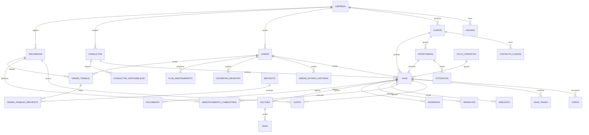

# Arquitectura de Información + Modelo de Datos — R&T SITRAM SAC

> **Propósito:** definir la estructura lógica de información del futuro sistema digital de R&T SITRAM SAC: entidades, relaciones, campos principales, estados, reglas de integridad, trazabilidad y criterios de diseño necesarios para convertir el Blueprint Funcional en una base de datos coherente y escalable.

**Empresa:** R&T SITRAM SAC  
**Actividad:** Transporte nacional de carga pesada  
**Base de operaciones:** Cusco, Perú  
**Documento:** Arquitectura de Información + Modelo de Datos  
**Versión:** 1.0  
**Estado:** Diseño lógico inicial  
**Base:** Informe Contextual + Diagnóstico Operativo + Modelo TO-BE + Blueprint Funcional

---

# 1. Objetivo de la Arquitectura de Información

El sistema debe organizar toda la información del negocio de manera que sea posible relacionar:

**clientes + cargas + viajes + unidades + conductores + dinero + mantenimiento + documentos + tiempo + rentabilidad.**

La arquitectura debe evitar que cada módulo funcione como una isla.

Por ejemplo:

Un abastecimiento de combustible no debe ser simplemente un gasto.

Debe poder conocerse:

- a qué viaje pertenece;
- qué unidad abasteció;
- quién conducía;
- en qué kilometraje ocurrió;
- cuánto combustible se compró;
- cuánto costó;
- qué comprobante lo sustenta.

De la misma manera, un mantenimiento debe poder afectar posteriormente:

- costo de la unidad;
- disponibilidad;
- rentabilidad;
- historial;
- próximas alertas.

---

# 2. Principio Arquitectónico Central

La arquitectura deberá construirse alrededor de tres niveles principales.

## Nivel 1 — Maestros

Información relativamente estable.

Ejemplos:

- empresa;
- usuarios;
- clientes;
- unidades;
- conductores;
- proveedores;
- talleres;
- rutas;
- categorías.

---

## Nivel 2 — Operaciones

Información generada durante el trabajo diario.

Ejemplos:

- oportunidades;
- viajes;
- abastecimientos;
- gastos;
- adelantos;
- rendiciones;
- mantenimientos;
- incidencias;
- facturas;
- pagos.

---

## Nivel 3 — Analítica

Información derivada.

Ejemplos:

- utilidad;
- costo por kilómetro;
- utilización de flota;
- kilómetros vacíos;
- tiempo improductivo;
- rentabilidad por cliente.

Los indicadores deben calcularse a partir de datos operativos y no almacenarse como información manual cuando puedan derivarse.

---

# 3. Entidad Central

La entidad operativa principal será:

# VIAJE

El viaje funcionará como punto de unión entre:

- cliente;
- carga;
- unidad;
- conductor;
- ruta;
- combustible;
- gastos;
- adelantos;
- rendiciones;
- incidencias;
- documentos;
- facturación;
- cobranza;
- rentabilidad.

Sin embargo, el viaje **no debe contener físicamente todos esos datos dentro de un único registro**.

Cada grupo tendrá su propia entidad relacionada.

---

# 4. Jerarquía Conceptual General

```text id="s69k7o"
EMPRESA
│
├── USUARIOS
│
├── CLIENTES
│   ├── CONTACTOS
│   ├── OPORTUNIDADES
│   ├── VIAJES
│   ├── FACTURAS
│   └── PAGOS
│
├── FLOTA
│   └── UNIDADES
│       ├── ESTADOS
│       ├── VIAJES
│       ├── ABASTECIMIENTOS
│       ├── MANTENIMIENTOS
│       ├── REPUESTOS
│       ├── DOCUMENTOS
│       └── INCIDENCIAS
│
├── CONDUCTORES
│   ├── VIAJES
│   ├── DOCUMENTOS
│   └── INCIDENCIAS
│
├── VIAJES
│   ├── TRAMOS
│   ├── CARGAS
│   ├── ABASTECIMIENTOS
│   ├── GASTOS
│   ├── ADELANTOS
│   ├── RENDICIONES
│   ├── DOCUMENTOS
│   ├── INCIDENCIAS
│   └── COBRANZA
│
└── PROVEEDORES
    ├── TALLERES
    ├── COMBUSTIBLE
    ├── REPUESTOS
    └── OTROS
```

---

# 5. Dominios de Información

La arquitectura se dividirá en diez dominios.

## Dominio A — Organización y seguridad

- Empresa.
- Usuario.
- Rol.
- Permiso.
- Auditoría.

## Dominio B — Comercial

- Cliente.
- Contacto.
- Oportunidad.
- Cotización.

## Dominio C — Operaciones

- Viaje.
- Ciclo operativo.
- Tramo.
- Ruta.
- Carga.
- Estado de viaje.

## Dominio D — Flota

- Unidad.
- Estado de unidad.
- Odómetro.
- Documento vehicular.

## Dominio E — Personal

- Conductor.
- Disponibilidad.
- Documento.
- Contrato.

## Dominio F — Dinero del viaje

- Adelanto.
- Gasto.
- Abastecimiento.
- Rendición.

## Dominio G — Mantenimiento

- Plan de mantenimiento.
- Orden de trabajo.
- Repuesto.
- Servicio realizado.

## Dominio H — Facturación y cobranza

- Factura.
- Pago.
- Cuenta por cobrar.

## Dominio I — Gestión documental e incidencias

- Documento.
- Archivo.
- Incidencia.

## Dominio J — Analítica

- KPIs.
- agregaciones;
- vistas;
- reportes.

---

# 6. Convenciones Generales de Datos

Cada entidad principal deberá contener como mínimo:

```text id="hke6t3"
id
created_at
updated_at
created_by
updated_by
status
```

Cuando sea necesario:

```text id="w64ycm"
deleted_at
deleted_by
cancellation_reason
```

La eliminación física deberá evitarse en información operativa o financiera importante.

---

# 7. Identificadores Internos

Las entidades deberían utilizar identificadores técnicos únicos.

Recomendación:

```text id="tnd7q0"
UUID
```

Ejemplo:

```text id="r5tpg4"
8e44a0cf-...
```

Estos identificadores no necesitan mostrarse al usuario.

---

# 8. Identificadores de Negocio

Además del ID técnico, algunas entidades tendrán códigos legibles.

Ejemplo de viaje:

```text id="df6bm4"
RT-2026-000145
```

Ejemplo de ciclo:

```text id="ouqgj2"
RTC-2026-000048
```

Ejemplo de orden de mantenimiento:

```text id="jeir3b"
OT-2026-000073
```

El código debe ser:

- único;
- inmutable;
- generado automáticamente.

---

# 9. Entidad EMPRESA

Representa a R&T SITRAM SAC.

Aunque inicialmente exista una sola empresa, conviene no codificar los datos directamente en el sistema.

## Campos

```text id="ubiyeo"
id
razon_social
nombre_comercial
ruc
direccion
departamento
provincia
distrito
telefono
email
logo_url
regimen_tributario
moneda_base
zona_horaria
activo
created_at
updated_at
```

### Valor inicial esperado

```text id="ks16rl"
moneda_base = PEN
zona_horaria = America/Lima
```

---

# 10. Entidad USUARIO

Representa a una persona con acceso al sistema.

## Campos

```text id="qcn1vr"
id
empresa_id
nombre
apellido
email
telefono
auth_user_id
rol_id
activo
ultimo_acceso_at
created_at
updated_at
```

---

# 11. Entidad ROL

Ejemplos:

```text id="gsoxdd"
GERENCIA
ADMINISTRACION
CONDUCTOR
CONTABILIDAD
```

## Campos

```text id="jg9c4b"
id
empresa_id
codigo
nombre
descripcion
activo
```

---

# 12. Entidad PERMISO

Permite no depender exclusivamente de roles rígidos.

Ejemplos:

```text id="frg2ee"
VIAJE_CREAR
VIAJE_EDITAR
RENDICION_APROBAR
RENTABILIDAD_VER
MANTENIMIENTO_EDITAR
USUARIOS_GESTIONAR
```

Relación:

```text id="7clu4l"
ROL N:M PERMISO
```

mediante:

```text id="c5jr6h"
rol_permiso
```

---

# 13. Entidad CLIENTE

Representa tanto personas como empresas que contratan transporte.

## Campos

```text id="k3o53g"
id
empresa_id
tipo_persona
razon_social
nombre_comercial
tipo_documento
numero_documento
sector
direccion
ciudad
departamento
tipo_relacion
clasificacion
condicion_pago_dias
limite_credito
activo
observaciones
created_at
updated_at
```

---

# 14. Tipo de Relación Comercial

Valores iniciales sugeridos:

```text id="3hpjro"
DIRECTO
INTERMEDIARIO
TERCERO
```

No deben confundirse con la clasificación de calidad del cliente.

---

# 15. Clasificación de Cliente

```text id="y9ouq3"
A_ESTRATEGICO
B_RECURRENTE
C_OCASIONAL
D_RIESGO
SIN_CLASIFICAR
```

La clasificación puede comenzar manualmente y evolucionar posteriormente hacia un score calculado.

---

# 16. Entidad CONTACTO_CLIENTE

Un cliente puede tener varios contactos.

## Campos

```text id="ca6fr3"
id
cliente_id
nombre
cargo
telefono
email
es_principal
activo
```

Relación:

```text id="sbtlkd"
CLIENTE 1:N CONTACTO_CLIENTE
```

---

# 17. Entidad OPORTUNIDAD

Representa una carga potencial antes de convertirse en viaje.

## Campos

```text id="8bnk8f"
id
empresa_id
codigo
cliente_id
contacto_id
fecha_registro
fecha_requerida
origen
destino
tipo_carga
descripcion_carga
toneladas_estimadas
tarifa_propuesta
moneda
retorno_estado
estado
probabilidad
fuente
observaciones
created_by
created_at
updated_at
```

---

# 18. Estados de Oportunidad

```text id="r1gg4u"
NUEVA
EVALUACION
COTIZADA
NEGOCIACION
ACEPTADA
RECHAZADA
PERDIDA
CONVERTIDA
```

---

# 19. Fuente de Oportunidad

Inicialmente:

```text id="spoyil"
RECOMENDACION
CLIENTE_EXISTENTE
INTERMEDIARIO
PROSPECCION_DIRECTA
OTRO
```

Esto permitirá conocer posteriormente de dónde vienen los clientes.

---

# 20. Entidad COTIZACION

Una oportunidad puede tener más de una propuesta.

## Campos

```text id="g3u9vi"
id
oportunidad_id
version
fecha
monto_flete
monto_adicional
costo_estimado_combustible
costo_estimado_otros
costo_estimado_total
margen_estimado
margen_porcentaje
tarifa_minima_referencia
estado
vigencia_hasta
observaciones
created_by
created_at
```

---

# 21. Estados de Cotización

```text id="oxbsjz"
BORRADOR
ENVIADA
ACEPTADA
RECHAZADA
VENCIDA
ANULADA
```

---

# 22. Entidad VIAJE

Entidad central de la arquitectura.

## Campos principales

```text id="b6j49h"
id
empresa_id
codigo
oportunidad_id
cliente_id
unidad_id
conductor_id
ciclo_id
ruta_id
tipo_servicio
modalidad_comercial
estado
fecha_programada
fecha_inicio_real
fecha_fin_operativa
fecha_cierre_financiero
origen
destino
kilometraje_inicio
kilometraje_fin
flete_base
monto_adicional
ingreso_esperado
observaciones
created_by
created_at
updated_at
```

---

# 23. Campo modalidad_comercial

Valores:

```text id="1zimfq"
DIRECTO
TERCERIZADO
```

Esto permitirá medir:

```text id="fablut"
% viajes directos
vs.
% viajes tercerizados
```

---

# 24. Estados del Viaje

Catálogo inicial:

```text id="mac17r"
OPORTUNIDAD
EVALUACION
APROBADO
PROGRAMADO
EN_CARGA
EN_TRANSITO
EN_DESCARGA
ESPERANDO_RETORNO
RETORNO_PROGRAMADO
EN_RETORNO
RENDICION_PENDIENTE
COBRANZA_PENDIENTE
CERRADO
CANCELADO
```

La máquina de estados deberá controlar qué transiciones son válidas.

---

# 25. Historial de Estado del Viaje

Entidad:

# VIAJE_ESTADO_HISTORIAL

## Campos

```text id="srfqn5"
id
viaje_id
estado_anterior
estado_nuevo
fecha_hora
usuario_id
ubicacion_texto
motivo
observacion
```

Nunca debe dependerse únicamente del `estado` actual.

El historial permitirá calcular tiempos.

Ejemplo:

**3 días en ESPERANDO_RETORNO.**

---

# 26. Entidad CICLO_OPERATIVO

Permite agrupar varios tramos relacionados económicamente.

Ejemplo:

```text id="cue1tq"
Cusco → Lima
Lima → Cusco
```

## Campos

```text id="3z29ep"
id
empresa_id
codigo
unidad_id
conductor_principal_id
fecha_inicio
fecha_fin
estado
observaciones
```

Relación:

```text id="feay9y"
CICLO_OPERATIVO 1:N VIAJE
```

---

# 27. Diferencia entre VIAJE y TRAMO

Se recomienda modelar inicialmente:

**un VIAJE = un servicio comercial origen → destino.**

Ejemplo:

Cusco → Lima.

Si posteriormente un mismo servicio requiere varias etapas físicas, podrá incorporarse:

# VIAJE_TRAMO

---

# 28. Entidad VIAJE_TRAMO — Preparada para Crecimiento

## Campos

```text id="8gzkyy"
id
viaje_id
orden
origen
destino
fecha_salida
fecha_llegada
kilometraje_inicio
kilometraje_fin
con_carga
observaciones
```

Esto permitirá determinar con precisión:

- kilómetros cargados;
- kilómetros vacíos.

Para el MVP puede utilizarse de manera simplificada.

---

# 29. Entidad RUTA

Representa una ruta reutilizable.

## Campos

```text id="2f90cw"
id
empresa_id
nombre
origen
destino
distancia_referencia_km
duracion_referencia_horas
activo
observaciones
```

Ejemplos:

```text id="5224ry"
Cusco → Lima
Lima → Cusco
Cusco → Ilo
```

No debe asumirse que las distancias reales siempre serán idénticas.

---

# 30. Entidad CARGA

Un viaje podría transportar una o varias cargas.

## Campos

```text id="2kj0l1"
id
viaje_id
descripcion
tipo_carga
toneladas
cantidad_bultos
unidad_medida
es_sobrecarga
monto_adicional
observaciones
```

Relación:

```text id="6xvj1a"
VIAJE 1:N CARGA
```

---

# 31. Entidad UNIDAD

Representa el tracto/unidad vehicular principal controlada por el negocio.

## Campos

```text id="bvder5"
id
empresa_id
placa
anio
marca
modelo
propietario_tipo
propietario_nombre
capacidad_toneladas
capacidad_objetivo_toneladas
kilometraje_actual
estado_actual
fecha_incorporacion
activo
observaciones
created_at
updated_at
```

---

# 32. Propiedad de Unidad

Valores sugeridos:

```text id="rd3l8d"
EMPRESA
PROPIETARIO_PERSONA
ALQUILADA
TERCERO
```

Actualmente la empresa usaría principalmente:

```text id="5fu43z"
EMPRESA
PROPIETARIO_PERSONA
```

---

# 33. Entidad UNIDAD_ESTADO_HISTORIAL

Es fundamental para medir utilización.

## Campos

```text id="zhtodd"
id
unidad_id
estado
fecha_inicio
fecha_fin
motivo
viaje_id
incidencia_id
mantenimiento_id
registrado_por
```

---

# 34. Estados de Unidad

```text id="bxbn27"
DISPONIBLE
PROGRAMADA
EN_VIAJE
ESPERANDO_CARGA
REGRESANDO_VACIA
MANTENIMIENTO_PREVENTIVO
REPARACION
ESPERANDO_TALLER
SIN_CONDUCTOR
BLOQUEADA
INMOVILIZADA
FUERA_SERVICIO
```

---

# 35. Regla de Estado de Unidad

Solo debe existir **un estado activo simultáneo** para cada unidad.

Formalmente:

```text id="k0ipmf"
una unidad no puede tener dos registros
UNIDAD_ESTADO_HISTORIAL
con fecha_fin = NULL
```

---

# 36. Entidad ODOMETRO_REGISTRO

El kilometraje no debe depender únicamente de un campo editable en la unidad.

## Campos

```text id="887znv"
id
unidad_id
viaje_id
fecha_hora
kilometraje
tipo_registro
fuente
registrado_por
```

Tipos:

```text id="7u4e67"
SALIDA_VIAJE
LLEGADA
COMBUSTIBLE
MANTENIMIENTO
MANUAL
```

El campo `unidad.kilometraje_actual` puede mantenerse como dato rápido derivado del último registro válido.

---

# 37. Regla de Kilometraje

Un nuevo kilometraje no debería ser inferior al anterior salvo corrección autorizada.

Si ocurre:

```text id="79o9db"
mostrar advertencia
+
exigir motivo
```

---

# 38. Entidad CONDUCTOR

## Campos

```text id="vvridd"
id
empresa_id
usuario_id
nombres
apellidos
tipo_documento
numero_documento
telefono
direccion
fecha_ingreso
tipo_contrato
fecha_fin_contrato
estado
unidad_habitual_id
activo
observaciones
```

---

# 39. Estados del Conductor

```text id="dh7cfs"
DISPONIBLE
ASIGNADO
EN_VIAJE
DESCANSO
VACACIONES
LICENCIA
NO_DISPONIBLE
INACTIVO
```

---

# 40. Entidad CONDUCTOR_DISPONIBILIDAD

Permite mantener historial.

## Campos

```text id="ohlrps"
id
conductor_id
estado
fecha_inicio
fecha_fin
motivo
registrado_por
```

---

# 41. Entidad CONDUCTOR_RESPALDO

Puede modelarse como conductor con:

```text id="4yu9h9"
tipo_vinculo = RESPALDO
```

en lugar de crear una tabla completamente independiente.

Esto permite reutilizar la misma lógica.

---

# 42. Entidad ADELANTO

Representa dinero entregado al conductor.

## Campos

```text id="fmerkp"
id
empresa_id
viaje_id
conductor_id
fecha
monto
moneda
medio_entrega
referencia
concepto
estado
comprobante_archivo_id
created_by
created_at
```

---

# 43. Estados del Adelanto

```text id="2zeb1j"
ENTREGADO
PARCIALMENTE_RENDIDO
RENDIDO
ANULADO
```

---

# 44. Entidad GASTO

Representa un gasto operativo.

## Campos

```text id="xi4r9f"
id
empresa_id
viaje_id
unidad_id
conductor_id
categoria_gasto_id
proveedor_id
fecha
monto
moneda
tipo_comprobante
numero_comprobante
archivo_comprobante_id
descripcion
origen_registro
estado_validacion
created_by
created_at
updated_at
```

---

# 45. Gastos sin Viaje

Algunos gastos pertenecen a la empresa y no a un viaje.

Por ello:

```text id="h79uww"
viaje_id puede ser NULL
```

pero debe existir:

```text id="uu2tcw"
tipo_asignacion
```

Valores:

```text id="xmytzz"
VIAJE
UNIDAD
GENERAL
```

---

# 46. Categoría de Gasto

Entidad:

# CATEGORIA_GASTO

Campos:

```text id="x7tu9x"
id
empresa_id
codigo
nombre
tipo
activo
```

Valores iniciales:

```text id="tq49ed"
PEAJE
ALIMENTACION
GARAJE
HOSPEDAJE
REPARACION
REPUESTO
LLANTERIA
CARGA_DESCARGA
OTRO
```

Combustible debería manejarse en una entidad especializada, aunque financieramente también pueda clasificarse como gasto.

---

# 47. Entidad ABASTECIMIENTO_COMBUSTIBLE

## Campos

```text id="novmci"
id
empresa_id
viaje_id
unidad_id
conductor_id
proveedor_id
fecha_hora
ubicacion
kilometraje
cantidad
unidad_volumen
precio_unitario
monto_total
tipo_comprobante
numero_comprobante
archivo_comprobante_id
medio_pago
referencia_pago
created_by
created_at
```

---

# 48. Unidad de Volumen

Debe ser explícita.

Ejemplos:

```text id="cxvikp"
GALON
LITRO
```

Nunca guardar únicamente “cantidad = 120” sin unidad.

---

# 49. Cálculos Derivados de Combustible

Cuando existan datos:

```text id="hwk7xo"
costo_por_km
consumo_por_km
km_por_unidad_combustible
costo_por_viaje
```

Estos valores preferentemente se calculan, no se ingresan manualmente.

---

# 50. Entidad RENDICION

Representa el cierre económico del dinero entregado.

## Campos

```text id="7a7bf2"
id
viaje_id
conductor_id
fecha_inicio
fecha_presentacion
fecha_aprobacion
total_adelantos
total_gastos
saldo
estado
observaciones
aprobado_por
created_at
updated_at
```

---

# 51. Estados de Rendición

```text id="x8ycw1"
PENDIENTE
EN_REVISION
OBSERVADA
APROBADA
CERRADA
ANULADA
```

---

# 52. Relación Rendición ↔ Gastos

Una rendición puede incluir muchos gastos.

Entidad puente:

# RENDICION_GASTO

```text id="e27yao"
rendicion_id
gasto_id
```

Esto evita asumir que todos los gastos registrados pertenecen automáticamente a una única rendición.

---

# 53. Fórmula de Rendición

```text id="lyauri"
saldo =
total_adelantos
-
total_gastos_aprobados
```

Interpretación:

```text id="e84lgu"
saldo > 0
= conductor devuelve

saldo = 0
= conciliado

saldo < 0
= empresa debe reembolsar
```

---

# 54. Entidad PROVEEDOR

Debe unificar:

- grifos;
- talleres;
- repuesteras;
- llanterías;
- otros servicios.

## Campos

```text id="o2losz"
id
empresa_id
razon_social
nombre_comercial
ruc
tipo_proveedor
telefono
direccion
ciudad
condicion_pago
activo
observaciones
```

---

# 55. Tipos de Proveedor

```text id="n76c9b"
GRIFO
TALLER
REPUESTOS
LLANTERIA
SERVICIO
OTRO
```

Un proveedor podría tener más de una categoría.

Si esto se vuelve necesario, usar relación N:M.

---

# 56. Entidad PLAN_MANTENIMIENTO

Define lo que debería hacerse.

Ejemplo:

**Cambio de aceite cada X kilómetros.**

## Campos

```text id="7n2q9x"
id
unidad_id
tipo_mantenimiento
nombre
descripcion
frecuencia_km
frecuencia_dias
ultimo_kilometraje
ultima_fecha
proximo_kilometraje
proxima_fecha
estado
activo
```

---

# 57. Entidad ORDEN_TRABAJO

Representa una intervención concreta.

## Campos

```text id="m3473k"
id
empresa_id
codigo
unidad_id
proveedor_id
tipo_mantenimiento
origen
fecha_ingreso
fecha_inicio
fecha_fin
kilometraje
problema_reportado
diagnostico
trabajo_realizado
costo_mano_obra
costo_repuestos
costo_total
estado
observaciones
created_by
```

---

# 58. Estados de Orden de Trabajo

```text id="e1ygjo"
PROGRAMADA
ESPERANDO_TALLER
EN_TALLER
EN_PROCESO
ESPERANDO_REPUESTO
TERMINADA
CANCELADA
```

---

# 59. Entidad REPUESTO

Catálogo reutilizable.

## Campos

```text id="oj2ha2"
id
empresa_id
nombre
codigo_interno
marca
categoria
unidad_medida
activo
```

---

# 60. Entidad ORDEN_TRABAJO_REPUESTO

Relaciona reparaciones y piezas.

## Campos

```text id="2239a4"
id
orden_trabajo_id
repuesto_id
proveedor_id
cantidad
costo_unitario
costo_total
fecha_instalacion
kilometraje_instalacion
observaciones
```

---

# 61. Historial de Repuesto

Gracias a la relación anterior debería poder responderse:

> ¿Cuándo se cambió esta pieza?

> ¿Cuánto costó?

> ¿A qué kilometraje?

> ¿Cuánto duró?

Esto será especialmente útil para mantenimiento futuro.

---

# 62. Entidad DOCUMENTO

Conviene utilizar una arquitectura documental genérica.

## Campos

```text id="xzmg8x"
id
empresa_id
tipo_documento
numero
fecha_emision
fecha_vencimiento
entidad_tipo
entidad_id
archivo_id
estado
observaciones
created_by
created_at
```

---

# 63. entidad_tipo de DOCUMENTO

Puede referirse a:

```text id="oxjby0"
UNIDAD
CONDUCTOR
VIAJE
CLIENTE
EMPRESA
```

Ejemplos:

**SOAT → UNIDAD**

**Licencia → CONDUCTOR**

**Guía transportista → VIAJE**

---

# 64. Alternativa Relacional Más Estricta

Si durante arquitectura técnica se prefiere máxima integridad referencial, pueden crearse tablas especializadas:

```text id="euz28r"
documento_unidad
documento_conductor
documento_viaje
```

La decisión final dependerá de la tecnología utilizada.

---

# 65. Entidad ARCHIVO

No conviene guardar archivos pesados dentro de las tablas operativas.

## Campos

```text id="w4b4bg"
id
empresa_id
nombre_original
mime_type
tamano_bytes
storage_path
hash
uploaded_by
created_at
```

Los documentos únicamente referencian `archivo_id`.

---

# 66. Entidad INCIDENCIA

## Campos

```text id="im8jk7"
id
empresa_id
viaje_id
unidad_id
conductor_id
fecha_hora
ubicacion
tipo
severidad
descripcion
accion_tomada
estado
costo_estimado
archivo_id
created_by
created_at
```

---

# 67. Tipos de Incidencia

```text id="bh90fa"
AVERIA
ACCIDENTE
BLOQUEO
RETRASO
PROBLEMA_CARGA
PROBLEMA_DOCUMENTAL
CLIENTE
COMBUSTIBLE
CONDUCTOR
OTRO
```

---

# 68. Severidad

```text id="m4spv3"
BAJA
MEDIA
ALTA
CRITICA
```

---

# 69. Estados de Incidencia

```text id="oz59ch"
ABIERTA
EN_GESTION
RESUELTA
CERRADA
```

---

# 70. Entidad FACTURA

Representa lo facturado al cliente.

## Campos

```text id="bbavoi"
id
empresa_id
cliente_id
viaje_id
serie
numero
fecha_emision
fecha_vencimiento
moneda
subtotal
impuestos
total
saldo
estado
archivo_id
observaciones
created_at
```

---

# 71. Relación Viaje ↔ Factura

Inicialmente puede utilizarse:

```text id="7nyqwx"
VIAJE 1:N FACTURA
```

Esto permite:

- una factura por viaje;
- varias facturas;
- adicionales posteriores.

Si una factura reúne múltiples viajes, posteriormente podrá crearse:

```text id="lbwtkz"
FACTURA_VIAJE
```

como relación N:M.

Conviene dejar preparada esa posibilidad.

---

# 72. Estados de Factura

```text id="2l5mbd"
BORRADOR
EMITIDA
PARCIAL
PAGADA
VENCIDA
ANULADA
```

---

# 73. Entidad PAGO

## Campos

```text id="x1ihsg"
id
empresa_id
cliente_id
factura_id
fecha
monto
moneda
medio_pago
referencia
archivo_id
observaciones
created_by
created_at
```

Relación:

```text id="o3ppy5"
FACTURA 1:N PAGO
```

---

# 74. Saldo de Factura

Debe calcularse:

```text id="lmbu3z"
saldo =
total_factura
-
SUM(pagos_validos)
```

No debe ingresarse manualmente sin conciliación.

---

# 75. Cuenta por Cobrar

Conceptualmente existe una cuenta por cobrar.

No necesariamente necesita una tabla independiente si puede derivarse de:

```text id="kauyec"
FACTURA + PAGOS
```

Una vista lógica puede mostrar:

```text id="j4ylvc"
facturas donde saldo > 0
```

Esto evita duplicar información.

---

# 76. Entidad GASTO_GENERAL

Puede utilizarse la misma tabla GASTO mediante:

```text id="okqmyb"
tipo_asignacion = GENERAL
```

No es necesario crear otra tabla salvo que el proceso contable futuro lo requiera.

---

# 77. Costos Asignados a Unidad

Algunos costos no pertenecen directamente a un viaje pero sí a una unidad.

Ejemplos:

- mantenimiento;
- repuesto;
- seguros;
- documentación vehicular.

Deben poder clasificarse:

```text id="qnwn7p"
VIAJE
UNIDAD
GENERAL
```

Esto será fundamental para costeo posterior.

---

# 78. Modelo de Costeo

El sistema debe separar:

## Costos directos de viaje

```text id="v8g4vt"
combustible
peajes
alimentación
garajes
hospedaje
otros
```

## Costos de unidad

```text id="oy1fql"
mantenimiento
repuestos
neumáticos
seguros vehiculares
```

## Costos de personal

```text id="t988da"
conductores
administración
```

## Costos generales

```text id="pdfrxc"
contabilidad
asesorías
otros
```

---

# 79. Entidad COSTO_ASIGNACION — Fase Posterior

Para obtener rentabilidad económica más sofisticada puede incorporarse:

```text id="b921ya"
id
periodo
tipo_costo
origen_entidad
origen_id
viaje_id
unidad_id
monto_asignado
metodo_asignacion
```

Esto permitirá prorratear:

- administración;
- mantenimiento;
- remuneraciones;
- seguros.

No es obligatorio en el MVP.

---

# 80. Rentabilidad Derivada

El sistema no necesita una tabla manual llamada “utilidad” inicialmente.

Debe calcular:

```text id="c462p3"
ingreso_bruto
-
costos_directos
=
margen_directo
```

Después:

```text id="lxg347"
margen_directo
-
costos_operativos_asignados
=
margen_operativo
```

Y posteriormente:

```text id="sucpxk"
margen_operativo
-
costos_generales_prorrateados
=
utilidad_economica
```

---

# 81. Entidad ALERTA

Las alertas deben ser persistentes y trazables.

## Campos

```text id="cl80cd"
id
empresa_id
tipo
prioridad
entidad_tipo
entidad_id
titulo
mensaje
fecha_generacion
fecha_vencimiento
estado
resuelta_por
resuelta_at
```

---

# 82. Estados de Alerta

```text id="qhp3r6"
NUEVA
VISTA
EN_GESTION
RESUELTA
DESCARTADA
```

---

# 83. Tipos Iniciales de Alerta

```text id="zupgin"
DOCUMENTO_VENCE
DOCUMENTO_VENCIDO
MANTENIMIENTO_PROXIMO
MANTENIMIENTO_VENCIDO
COBRANZA_VENCIDA
RENDICION_PENDIENTE
UNIDAD_ESPERANDO_CARGA
UNIDAD_SIN_CONDUCTOR
CONSUMO_ANOMALO
MARGEN_BAJO
```

---

# 84. Entidad TAREA — Recomendación

Algunas alertas deberían convertirse en acciones.

Ejemplo:

**Alerta**
ITV vence.

**Tarea**
Renovar ITV.

## Campos

```text id="7t45hc"
id
empresa_id
titulo
descripcion
responsable_id
fecha_limite
prioridad
estado
entidad_tipo
entidad_id
created_at
```

---

# 85. Auditoría

Entidad:

# AUDITORIA_EVENTO

## Campos

```text id="8xfh5p"
id
empresa_id
usuario_id
accion
entidad_tipo
entidad_id
fecha_hora
valor_anterior
valor_nuevo
motivo
ip
dispositivo
```

Debe utilizarse para operaciones críticas.

---

# 86. Acciones Auditables

Como mínimo:

```text id="f3amb0"
CREAR
EDITAR
ANULAR
CERRAR
REABRIR
APROBAR
RECHAZAR
ELIMINAR_LOGICAMENTE
CAMBIAR_MONTO
CAMBIAR_TARIFA
CAMBIAR_ESTADO
```

---

# 87. Datos que No Deben Editarse Silenciosamente

Especialmente:

- flete cerrado;
- gasto aprobado;
- rendición cerrada;
- pago;
- factura;
- kilometraje histórico;
- mantenimiento finalizado.

Cualquier cambio posterior debe generar auditoría.

---

# 88. Eliminación Lógica

Para entidades críticas:

```text id="smkw4p"
is_deleted
deleted_at
deleted_by
deletion_reason
```

o equivalente.

No realizar:

```text id="low0d3"
DELETE físico
```

como operación normal.

---

# 89. Arquitectura de Estados

No se recomienda guardar estados como texto libre.

Deben existir:

- enumeraciones controladas;
- catálogos;
- o tablas de estados.

Esto evita:

```text id="gcv74r"
"En ruta"
"en viaje"
"Viajando"
```

como tres valores distintos para el mismo concepto.

---

# 90. Fechas y Horas

Internamente se recomienda guardar timestamps de manera consistente.

La interfaz mostrará:

```text id="402ldg"
America/Lima
```

Debe distinguirse entre:

```text id="1254r5"
fecha_programada
fecha_real
fecha_registro
```

Nunca sustituir una por otra.

---

# 91. Dinero

Todo monto debería utilizar:

```text id="z7t4of"
DECIMAL
```

y nunca tipos de punto flotante.

Campos monetarios:

```text id="xnwf0h"
monto
moneda
```

Actualmente la moneda base es:

```text id="gurlku"
PEN
```

pero la estructura debería soportar otras monedas si fuera necesario.

---

# 92. Toneladas

Usar precisión decimal.

Ejemplo:

```text id="05l4l6"
DECIMAL(10,3)
```

No asumir únicamente números enteros.

---

# 93. Kilometraje

Usar valor numérico positivo.

Debe diferenciarse:

```text id="ml9w51"
odometro absoluto
```

de:

```text id="tiuygg"
distancia recorrida calculada
```

---

# 94. Integridad de Datos — Viajes

Un viaje PROGRAMADO no debe existir sin:

```text id="jdpbar"
cliente_id
unidad_id
conductor_id
origen
destino
```

---

# 95. Integridad — Asignación de Unidad

Una unidad no puede asignarse simultáneamente a dos viajes incompatibles.

Debe verificarse:

```text id="dyxtv9"
viaje activo existente
```

antes de confirmar.

---

# 96. Integridad — Conductor

Un conductor tampoco puede tener dos viajes activos superpuestos.

---

# 97. Integridad — Documentación

Antes de programar:

```text id="8j3s7o"
SOAT vigente
ITV vigente
documentación requerida vigente
```

según reglas configuradas.

---

# 98. Integridad — Mantenimiento

Si la unidad tiene:

```text id="xp2vr2"
bloqueo_operativo = true
```

por mantenimiento crítico:

no debe poder programarse sin excepción autorizada.

---

# 99. Integridad — Rendiciones

Una rendición CERRADA:

```text id="s9qr7w"
no admite nuevas modificaciones normales
```

Cualquier reapertura debe:

```text id="vitxfi"
requerir permiso especial
+
motivo
+
auditoría
```

---

# 100. Integridad — Pagos

La suma de pagos válidos no debería superar el saldo facturado sin una justificación explícita.

---

# 101. Integridad — Documentos

Debe evitarse registrar accidentalmente el mismo:

```text id="3nugc1"
tipo + número + entidad
```

varias veces.

---

# 102. Arquitectura de Archivos

Los documentos no deben mezclarse sin clasificación.

Estructura lógica:

```text id="0lbyyj"
empresa/
  unidades/
    {unidad_id}/
  conductores/
    {conductor_id}/
  viajes/
    {viaje_id}/
  clientes/
    {cliente_id}/
```

La implementación física dependerá del servicio de almacenamiento utilizado.

---

# 103. Offline First para Conductores

El sistema debe considerar registros generados sin internet.

Cada registro móvil debería incluir:

```text id="gnphrg"
local_id
server_id
sync_status
created_at_device
updated_at_device
last_sync_at
```

---

# 104. Estados de Sincronización

```text id="n9yzs9"
LOCAL
PENDIENTE
SINCRONIZANDO
SINCRONIZADO
ERROR
CONFLICTO
```

---

# 105. Datos Permitidos Offline

Prioridad:

- viaje activo;
- combustible;
- gastos;
- fotografías;
- kilometraje;
- incidencias;
- confirmación de llegada.

---

# 106. Resolución de Conflictos

No todos los datos deben usar la misma estrategia.

## Datos simples

Ejemplo:

observación.

Puede utilizarse:

```text id="c0y50w"
última edición válida
```

## Datos financieros

Ejemplo:

gasto.

No deben fusionarse silenciosamente.

Debe detectarse duplicado o conflicto.

---

# 107. Idempotencia

Para evitar duplicados de sincronización, cada acción creada desde móvil debe tener identificador único.

Si el dispositivo reenvía la misma operación:

```text id="4fy0li"
el servidor debe reconocerla
y no crear un segundo registro
```

---

# 108. Detección de Duplicados

Especialmente importante para:

- combustible;
- gastos;
- pagos;
- comprobantes.

Se pueden considerar:

```text id="9b9bu0"
usuario
viaje
monto
fecha aproximada
número de comprobante
```

como señales.

Nunca borrar automáticamente sin revisión cuando exista duda.

---

# 109. Datos Derivados vs. Datos Fuente

## Datos fuente

Se registran directamente:

- monto combustible;
- kilometraje;
- flete;
- fecha;
- toneladas.

## Datos derivados

Se calculan:

- utilidad;
- costo/km;
- utilización;
- km vacíos;
- promedio de cobranza.

La arquitectura debe proteger esta separación.

---

# 110. Vistas Analíticas

Es recomendable construir vistas lógicas como:

```text id="r5hr78"
vw_viaje_costos
vw_viaje_rentabilidad
vw_unidad_utilizacion
vw_cliente_cobranza
vw_combustible_rendimiento
vw_mantenimiento_proximo
```

El nombre técnico final puede variar.

---

# 111. Vista de Rentabilidad de Viaje

Debe consolidar:

```text id="88ggxp"
viaje_id
ingresos
combustible
otros_gastos
costos_asignados
margen_directo
margen_operativo
utilidad_economica
```

Sin duplicar físicamente los datos originales.

---

# 112. Vista de Utilización de Unidad

Debe poder producir:

```text id="a6bk30"
unidad
periodo
dias_disponibles
dias_productivos
dias_esperando_carga
dias_taller
dias_sin_conductor
dias_bloqueada
utilizacion_porcentaje
```

---

# 113. Cálculo de Utilización

Conceptualmente:

```text id="evnxeg"
utilizacion =
tiempo_productivo
/
tiempo_disponible
```

Debe definirse exactamente qué estados cuentan como productivos antes de implementación.

Recomendación inicial:

### Productivos

```text id="mkzr4x"
EN_VIAJE
PROGRAMADA cuando efectivamente comprometida
```

### Improductivos

```text id="eihffa"
ESPERANDO_CARGA
ESPERANDO_TALLER
SIN_CONDUCTOR
BLOQUEADA
```

La definición final debe validarse durante implementación.

---

# 114. Kilómetros Vacíos

Debe calcularse a partir de tramos:

```text id="x7d2fp"
SUM(distancia donde con_carga = false)
```

Dividido entre:

```text id="54ajic"
SUM(distancia total)
```

---

# 115. Indicadores de Cliente

A partir de la arquitectura podrán derivarse:

```text id="b0wpba"
viajes_cliente
facturacion_cliente
utilidad_cliente
saldo_cliente
dias_promedio_pago
incidencias_cliente
frecuencia_cliente
```

---

# 116. Indicadores de Unidad

```text id="s8xgh9"
viajes
km
combustible
costo_combustible
mantenimiento
dias_parada
ingresos
utilidad
```

---

# 117. Indicadores de Conductor

Con cuidado de no interpretarlos automáticamente como desempeño individual:

```text id="jsuscf"
viajes
km
rendiciones
incidencias
consumo_promedio
```

Factores como ruta, carga y unidad deben considerarse antes de sacar conclusiones.

---

# 118. Catálogos Iniciales

El sistema deberá contar con catálogos administrables.

## Categoría de gasto

## Tipo de incidencia

## Tipo de documento

## Tipo de carga

## Tipo de mantenimiento

## Tipo de proveedor

## Estado de unidad

## Estado de viaje

## Medio de pago

## Unidad de medida

---

# 119. Evitar Texto Libre Cuando Exista Clasificación

Ejemplo incorrecto:

```text id="sm8n8y"
tipo_gasto = "comida chofer"
```

Ejemplo correcto:

```text id="wniszp"
categoria = ALIMENTACION
descripcion = "Cena del conductor en Nazca"
```

Esto permitirá análisis posterior.

---

# 120. Campo de Observaciones

Los textos libres siguen siendo importantes.

Pero deben complementar los datos estructurados.

No reemplazarlos.

---

# 121. Búsqueda

Las entidades principales deberían indexarse para búsqueda rápida por:

### Viaje
- código.

### Unidad
- placa.

### Cliente
- nombre;
- RUC.

### Conductor
- nombre;
- documento.

### Factura
- serie;
- número.

### Documento
- número.

---

# 122. Índices de Base de Datos Recomendados

Conceptualmente deberán existir índices sobre:

```text id="pv1gnt"
viaje.codigo
viaje.estado
viaje.unidad_id
viaje.cliente_id
viaje.fecha_inicio_real

gasto.viaje_id
gasto.fecha

abastecimiento.unidad_id
abastecimiento.viaje_id
abastecimiento.fecha_hora

factura.cliente_id
factura.estado
factura.fecha_vencimiento

orden_trabajo.unidad_id
documento.fecha_vencimiento
```

La optimización concreta se definirá en arquitectura técnica.

---

# 123. Relaciones Cardinales Principales

```text id="5jessa"
EMPRESA 1:N USUARIO

EMPRESA 1:N CLIENTE

CLIENTE 1:N CONTACTO

CLIENTE 1:N OPORTUNIDAD

OPORTUNIDAD 1:N COTIZACION

CLIENTE 1:N VIAJE

UNIDAD 1:N VIAJE

CONDUCTOR 1:N VIAJE

CICLO 1:N VIAJE

VIAJE 1:N CARGA

VIAJE 1:N GASTO

VIAJE 1:N ABASTECIMIENTO

VIAJE 1:N ADELANTO

VIAJE 1:N INCIDENCIA

VIAJE 1:N DOCUMENTO

VIAJE 1:N FACTURA

FACTURA 1:N PAGO

UNIDAD 1:N ORDEN_TRABAJO

ORDEN_TRABAJO 1:N ORDEN_TRABAJO_REPUESTO

UNIDAD 1:N DOCUMENTO

CONDUCTOR 1:N DOCUMENTO
```

---

# 124. Diagrama ER Conceptual



---

# 125. Flujo de Datos de un Viaje

```text id="g05ms4"
OPORTUNIDAD
    ↓
COTIZACIÓN
    ↓
VIAJE
    ↓
ASIGNACIÓN
├── UNIDAD
└── CONDUCTOR
    ↓
SALIDA
├── ODOMETRO
├── COMBUSTIBLE
├── ADELANTO
└── DOCUMENTOS
    ↓
EJECUCIÓN
├── GASTOS
├── ABASTECIMIENTOS
├── INCIDENCIAS
└── TRAMOS
    ↓
RETORNO
    ↓
RENDICIÓN
    ↓
CIERRE OPERATIVO
    ↓
FACTURA
    ↓
PAGO
    ↓
CIERRE FINANCIERO
    ↓
ANALÍTICA
```

---

# 126. Estados y Eventos

La arquitectura debe diferenciar:

## Estado

Situación actual.

Ejemplo:

```text id="r5hty1"
ESPERANDO_RETORNO
```

## Evento

Algo ocurrido.

Ejemplo:

```text id="brgxd3"
2026-08-12 14:32
unidad descargó en Lima
```

El estado permite operar.

Los eventos permiten reconstruir la historia.

---

# 127. Event Log Operativo

En una fase posterior puede existir:

# EVENTO_OPERATIVO

Campos:

```text id="8dso7n"
id
empresa_id
entidad_tipo
entidad_id
tipo_evento
fecha_hora
usuario_id
metadata
```

Esto facilitará analítica y automatización.

No es imprescindible en el MVP si los historiales específicos son suficientes.

---

# 128. Datos Sensibles y Accesos

No todos los usuarios deben consultar todo.

Ejemplo:

Un conductor necesita:

- su viaje;
- sus adelantos;
- gastos;
- documentos operativos.

No necesita:

- utilidad de toda la empresa;
- salarios administrativos;
- rentabilidad de otros conductores;
- cartera completa de clientes.

Los permisos deben aplicarse desde la capa de datos, no solamente ocultando botones.

---

# 129. Aislamiento por Empresa

Aunque inicialmente exista solo R&T SITRAM SAC, todas las entidades relevantes deberían contener:

```text id="hxk7gh"
empresa_id
```

Esto ayuda a:

- seguridad;
- consistencia;
- crecimiento futuro;
- pruebas;
- separación lógica.

---

# 130. Seguridad de Archivos

Los archivos no deberían ser públicos por defecto.

El acceso debe depender de:

```text id="1lrbvj"
usuario autenticado
+
empresa
+
permisos
```

---

# 131. Conservación de Información

La información histórica es valiosa especialmente para:

- mantenimiento;
- rentabilidad;
- clientes;
- combustible;
- auditoría.

Por ello, los registros cerrados deberían conservarse.

Las políticas exactas de conservación deberán validarse posteriormente con contabilidad y obligaciones legales aplicables.

---

# 132. Versionamiento de Datos Importantes

Para información especialmente crítica podría conservarse versión histórica.

Ejemplos:

- cotizaciones;
- tarifas;
- configuraciones de margen;
- reglas.

Nunca sobrescribir una cotización anterior si fue enviada a un cliente.

Crear nueva versión.

---

# 133. Datos del MVP

El MVP no necesita implementar toda la arquitectura desde el primer día.

## Entidades obligatorias MVP

```text id="xhtojb"
empresa
usuario
rol

cliente

unidad
unidad_estado_historial
odometro_registro

conductor
conductor_disponibilidad

viaje
viaje_estado_historial
carga

adelanto
gasto
categoria_gasto
abastecimiento_combustible
rendicion
rendicion_gasto

proveedor

plan_mantenimiento
orden_trabajo
repuesto
orden_trabajo_repuesto

documento
archivo

factura
pago

incidencia
alerta

auditoria_evento
```

---

# 134. Entidades Fase 2

```text id="veuszk"
oportunidad
cotizacion
ciclo_operativo
viaje_tramo
contacto_cliente
tarea
```

---

# 135. Entidades Fase 3

```text id="wb0hjx"
costo_asignacion
scores comerciales
modelos predictivos
integraciones GPS
integraciones contables
eventos analíticos avanzados
```

---

# 136. Datos Iniciales para Migración

Al iniciar el sistema deberán cargarse como mínimo:

## Empresa

R&T SITRAM SAC.

## Unidades

- X2Y756.
- X3N-719.
- VDR-768.

## Conductores

Tres conductores actuales.

## Clientes

Clientes vigentes relevantes.

## Proveedores

- grifos frecuentes;
- taller principal;
- proveedores relevantes.

## Documentos

Documentación actualmente vigente.

## Mantenimiento

Últimos registros disponibles cuando sean confiables.

No es obligatorio reconstruir toda la historia desde 2013.

---

# 137. Calidad de Migración

La regla debería ser:

> **Es mejor iniciar con menos datos confiables que con muchos datos inconsistentes.**

Los históricos de Excel deben clasificarse:

### Importar

Datos claros y útiles.

### Archivar

Datos útiles solo como referencia.

### Descartar

Duplicados o información imposible de validar.

---

# 138. Campos Obligatorios del Viaje — MVP

Para crear:

```text id="id85zy"
cliente_id
origen
destino
fecha_programada
```

Para programar:

```text id="b74frc"
unidad_id
conductor_id
```

Para iniciar:

```text id="ph1zl0"
kilometraje_inicio
```

Para cerrar operativamente:

```text id="snt92d"
fecha_fin
kilometraje_fin
rendicion completada
```

---

# 139. Evitar Bloqueos Excesivos

El sistema debe proteger la integridad sin dificultar el trabajo.

Ejemplo:

Si falta un documento opcional:

```text id="87lka5"
advertir
```

No necesariamente bloquear.

Si SOAT obligatorio está vencido:

```text id="3bgvqk"
bloqueo crítico
```

Las reglas exactas deben ser configurables.

---

# 140. Configuración Empresarial

Debe existir:

# CONFIGURACION_EMPRESA

Campos potenciales:

```text id="xvep01"
margen_minimo
dias_alerta_documentos
dias_alerta_cobranza
dias_alerta_rendicion
moneda
unidad_combustible
unidad_distancia
unidad_peso
```

Esto evita valores rígidos dentro del código.

---

# 141. Modelo de Notificaciones

La información debe producir eventos útiles.

Ejemplo:

```text id="rsfgjb"
documento.fecha_vencimiento
```

genera:

```text id="9l0x54"
ALERTA
```

que puede generar:

```text id="to4hfp"
NOTIFICACION
```

Así se separa:

**el hecho empresarial**  
de  
**el canal utilizado para avisarlo.**

---

# 142. Preparación para GPS

No almacenar directamente la integración dentro de VIAJE.

Crear futura entidad:

# GPS_POSICION

```text id="y42jwf"
id
unidad_id
fecha_hora
latitud
longitud
velocidad
fuente
```

Y:

# GPS_EVENTO

```text id="ee7tto"
unidad_id
tipo
fecha_hora
metadata
```

Esto permitirá integrar distintos proveedores sin rediseñar viajes.

---

# 143. Preparación para Facturación Electrónica

La FACTURA del sistema debe ser una entidad de negocio independiente de SUNAT.

Posteriormente puede contener:

```text id="xdlfon"
external_id
estado_sunat
xml_url
cdr_url
```

si se integra un proveedor electrónico.

---

# 144. Preparación para IA

La arquitectura debe generar información estructurada suficientemente buena para futuras consultas.

Ejemplo:

La pregunta:

> ¿Qué ruta deja mayor utilidad?

requiere relacionar:

```text id="uinuin"
ruta
viaje
ingreso
gasto
combustible
costos
```

Si todos esos datos están estructurados, la IA puede analizarlos.

Si existen únicamente como mensajes y PDFs, será mucho más difícil.

---

# 145. Campos de Procedencia

Cuando un dato puede llegar de diferentes fuentes conviene guardar:

```text id="ppn6ve"
source
```

Ejemplos:

```text id="wlyxah"
ADMINISTRACION
CONDUCTOR_APP
GPS
IMPORTACION
SISTEMA
```

Esto mejora la trazabilidad.

---

# 146. Soft Validation vs. Hard Validation

## Hard Validation

Impide guardar.

Ejemplo:

```text id="t74rd5"
monto negativo
```

## Soft Validation

Permite guardar con advertencia.

Ejemplo:

```text id="hp4nmw"
consumo de combustible mayor de lo habitual
```

La mayoría de anomalías operativas deberían ser advertencias, no bloqueos automáticos.

---

# 147. Reglas de Cierre Operativo

Un viaje podrá pasar a:

```text id="t7nz8h"
CERRADO_OPERATIVAMENTE
```

cuando:

- transporte terminó;
- kilometraje final existe;
- gastos relevantes registrados;
- rendición conciliada;
- documentos obligatorios cargados o justificados.

Puede continuar con deuda pendiente.

---

# 148. Reglas de Cierre Financiero

Será posible cuando:

- ingresos definitivos registrados;
- costos conocidos registrados;
- factura asociada cuando corresponda;
- pagos conciliados o condición financiera definida;
- no existan ajustes pendientes críticos.

---

# 149. Estado Compuesto del Viaje

Para evitar demasiada complejidad, puede mantenerse:

```text id="h5wcj6"
estado_operativo
```

y separarse:

```text id="hc403x"
estado_financiero
```

Ejemplo:

```text id="8i8s5i"
estado_operativo = FINALIZADO

estado_financiero = PENDIENTE_COBRO
```

Esta separación es conceptualmente más limpia que intentar representar todo en una única secuencia.

---

# 150. Recomendación de Mejora al Blueprint Anterior

A nivel de datos se recomienda separar definitivamente:

# Estado Operativo

```text id="l7zzja"
PLANIFICADO
EN_CARGA
EN_TRANSITO
EN_DESCARGA
ESPERANDO_RETORNO
FINALIZADO
CANCELADO
```

de:

# Estado Administrativo

```text id="xp3ssg"
RENDICION_PENDIENTE
RENDICION_CERRADA
```

y:

# Estado Financiero

```text id="q0ayf2"
POR_FACTURAR
POR_COBRAR
COBRADO
CERRADO
```

Esto evita que un solo campo `estado_viaje` intente representar tres procesos distintos.

---

# 151. Modelo Recomendado de VIAJE Refinado

Por tanto:

```text id="2j15r6"
viaje.estado_operativo
viaje.estado_administrativo
viaje.estado_financiero
```

Esto permitirá situaciones reales como:

```text id="zr4z4o"
Operativo: FINALIZADO
Administrativo: RENDICION_CERRADA
Financiero: POR_COBRAR
```

Mucho más preciso.

---

# 152. Modelo de Disponibilidad Real

La disponibilidad de una unidad debe derivarse de:

```text id="on8sj7"
estado_unidad
+
viaje_activo
+
mantenimiento
+
documentos
+
conductor disponible
```

Por tanto, puede existir:

```text id="ep31yh"
estado_fisico = DISPONIBLE
```

pero:

```text id="xk5gek"
apta_para_programar = false
```

si ITV está vencida.

---

# 153. Campo Derivado apta_para_programar

No debería ser editable manualmente.

Debe calcularse.

Ejemplo conceptual:

```text id="g3tw4i"
apta_para_programar =
estado_operativo compatible
AND documentos críticos vigentes
AND sin bloqueo mantenimiento
```

---

# 154. Fuente Única de Verdad

Para cada concepto debe definirse una única autoridad.

## Kilometraje

ODOMETRO_REGISTRO.

## Saldo de factura

FACTURA + PAGOS.

## Gasto de viaje

GASTO + ABASTECIMIENTO.

## Estado histórico de unidad

UNIDAD_ESTADO_HISTORIAL.

## Documentación

DOCUMENTO.

## Rendición

RENDICION.

Las pantallas solo presentan esos datos.

No mantienen copias independientes.

---

# 155. Anti-Patrones que Deben Evitarse

## 1. Tabla VIAJES gigante

Con columnas para absolutamente todo.

## 2. Texto libre para categorías

## 3. Guardar utilidad manualmente

## 4. Guardar archivos dentro de las filas operativas

## 5. Borrar movimientos financieros

## 6. Tener una tabla diferente por cada placa

## 7. Duplicar clientes por errores de escritura

## 8. Mezclar adelantos y gastos

## 9. Mezclar mantenimiento y gasto genérico sin relación

## 10. Utilizar WhatsApp como registro definitivo

---

# 156. Normalización Recomendada

El modelo lógico debería aproximarse a una estructura relacional normalizada.

Ejemplo:

No guardar:

```text id="bin05f"
viaje.cliente_nombre
```

como fuente principal.

Guardar:

```text id="smw1ry"
viaje.cliente_id
```

y obtener el nombre desde CLIENTE.

Puede guardarse una copia histórica solo cuando exista una razón jurídica/comercial específica.

---

# 157. Datos Históricos Inmutables

Debe analizarse caso por caso.

Por ejemplo, si un cliente cambia de razón social, una factura antigua debe conservar la información con la que fue emitida.

Por ello algunos documentos financieros pueden necesitar:

```text id="h951pq"
snapshot histórico
```

además de referencias maestras.

---

# 158. Snapshots Recomendados

Para VIAJE puede ser útil conservar cuando se cierre:

```text id="zb2ach"
tarifa_acordada
origen
destino
descripcion_carga
```

aunque el catálogo maestro cambie posteriormente.

---

# 159. Modelo de Configuraciones Históricas

Cuando una regla económica cambie, no debería alterar cálculos históricos.

Ejemplo:

margen mínimo actual = 15%.

Si hace seis meses era 10%, los viajes antiguos no deberían reinterpretarse automáticamente con la nueva regla.

Guardar:

```text id="xp2voy"
margen_objetivo_aplicado
```

en la evaluación correspondiente.

---

# 160. Reportabilidad como Requisito Arquitectónico

Antes de crear cualquier campo debe preguntarse:

> ¿Qué pregunta empresarial permitirá responder?

Ejemplo:

Guardar `fecha_inicio_espera` permite calcular:

**días esperando carga.**

Guardar únicamente:

```text id="76uyc0"
estado = ESPERANDO_CARGA
```

sin historial no permite medir duración.

---

# 161. Datos Necesarios para la North Star Metric

Para calcular:

# Utilidad por unidad por día disponible

se necesita:

```text id="z65v31"
unidad
periodo
ingresos
costos
estado_unidad_historico
tiempo_disponible
```

Por ello la arquitectura de estados es tan importante como la financiera.

---

# 162. Reglas para Analítica Futura

Los datos operativos deberán conservar:

- fecha;
- unidad;
- cliente;
- viaje;
- ruta;
- conductor;
- monto;
- estado;
- duración.

Esto permitirá construir análisis temporales.

---

# 163. Estrategia de Históricos

No sobrescribir:

```text id="g610yz"
estado anterior
kilometraje anterior
tarifa anterior
orden anterior
```

cuando se necesite analizar evolución.

Crear nuevos eventos o versiones.

---

# 164. Arquitectura de Información de Pantallas

Cada pantalla debe consumir un conjunto claro de entidades.

## Dashboard

```text id="s22q8g"
unidad
viaje
alerta
factura
mantenimiento
```

## Detalle Viaje

```text id="7mo7j8"
viaje
cliente
unidad
conductor
carga
gasto
combustible
adelanto
rendicion
documento
incidencia
factura
pago
```

## Flota

```text id="fu80bj"
unidad
estado
odometro
mantenimiento
documento
```

## Cobranza

```text id="sqz4hv"
cliente
factura
pago
```

---

# 165. Arquitectura de Información del Conductor

La aplicación del conductor no necesita copiar la base administrativa completa.

Debe sincronizar únicamente:

```text id="50oga6"
viaje asignado
unidad
datos esenciales de carga
documentos necesarios
adelantos
gastos propios
combustible
incidencias
```

Principio:

> Descargar solo la información necesaria para ejecutar el trabajo.

---

# 166. Propiedad de los Registros

Debe definirse quién puede originar cada información.

## Administración

- viaje;
- cliente;
- asignación;
- adelanto;
- cobranza.

## Conductor

- gasto;
- comprobante;
- combustible;
- kilometraje;
- incidencia.

## Sistema

- alertas;
- indicadores;
- cálculos.

## Contabilidad

- validaciones o datos financieros permitidos según configuración.

---

# 167. Estados de Validación

Para información enviada por conductores puede existir:

```text id="u5tw8r"
PENDIENTE_REVISION
VALIDADO
OBSERVADO
RECHAZADO
```

Especialmente en:

- gastos;
- comprobantes;
- incidencias económicas.

---

# 168. Correcciones

Si el conductor registra:

```text id="z9jo6r"
S/ 150
```

y administración determina:

```text id="a1l28q"
S/ 105
```

no conviene sobrescribir silenciosamente.

Registrar:

```text id="iuidvr"
monto_reportado
monto_aprobado
```

cuando corresponda.

---

# 169. Comprobantes

Para un gasto puede distinguirse:

```text id="z4lnas"
monto_reportado
monto_comprobante
monto_aprobado
```

Solo si esta complejidad realmente es necesaria durante la validación.

Para el MVP puede comenzar con:

```text id="g9q5hw"
monto
estado_validacion
```

y agregarse posteriormente.

---

# 170. Modelo de Datos MVP Simplificado

Para evitar sobreingeniería, la primera implementación puede centrarse en aproximadamente estas tablas:

```text id="fdbpvk"
empresas
usuarios
roles

clientes

unidades
unidad_estados
odometro_registros

conductores
conductor_disponibilidad

viajes
viaje_estados
cargas

proveedores

adelantos
gastos
categorias_gasto
abastecimientos_combustible
rendiciones
rendicion_gastos

planes_mantenimiento
ordenes_trabajo
repuestos
orden_trabajo_repuestos

documentos
archivos

facturas
pagos

incidencias
alertas

auditoria
```

Esto ya permitiría construir un sistema operativo muy sólido.

---

# 171. Entidades que No Conviene Construir Antes de Necesitarlas

Evitar inicialmente:

- modelos de IA;
- pronósticos;
- scoring complejo;
- inventario completo de almacén;
- telemetría masiva;
- contabilidad de doble partida completa;
- módulo jurídico complejo;
- recursos humanos tipo ERP.

El sistema debe crecer a partir del uso real.

---

# 172. Roadmap del Modelo de Datos

## Etapa 1 — Núcleo Maestro

```text id="qm7b2g"
empresa
usuario
cliente
unidad
conductor
proveedor
```

## Etapa 2 — Operación

```text id="b6jouh"
viaje
carga
estados
odometro
```

## Etapa 3 — Dinero del Viaje

```text id="qe7di7"
adelanto
gasto
combustible
rendicion
```

## Etapa 4 — Flota

```text id="f37sru"
mantenimiento
repuesto
documentos
```

## Etapa 5 — Finanzas

```text id="dc7rao"
factura
pago
costeo
```

## Etapa 6 — Analítica

```text id="k5gtfi"
vistas
KPIs
alertas
```

---

# 173. Ejemplo de Registro Completo

## Viaje

```text id="51rdr6"
RT-2026-000145
```

Cliente:

```text id="r67h1s"
Cliente ABC
```

Unidad:

```text id="zqz2ol"
X2Y756
```

Conductor:

```text id="zjq3jx"
Conductor 01
```

Ruta:

```text id="7i4mvc"
Cusco → Lima
```

Carga:

```text id="g1exj3"
32 toneladas
```

Flete:

```text id="ohelsy"
S/ 3,200
```

Durante el viaje se relacionan:

```text id="y7kkdo"
2 abastecimientos
6 gastos
1 adelanto
7 comprobantes
1 guía remitente
1 guía transportista
0/varias incidencias
```

Al finalizar:

```text id="utcdy8"
rendición cerrada
```

Posteriormente:

```text id="n6i1lv"
factura emitida
```

Finalmente:

```text id="qjoshh"
pago recibido
```

Todo permanece conectado por IDs y no mediante nombres escritos manualmente.

---

# 174. Preguntas que el Modelo de Datos Debe Poder Responder

## Operación

¿Cuántos viajes realizó X2Y756?

## Tiempo

¿Cuántos días estuvo sin producir?

## Combustible

¿Cuánto consumió en Cusco–Lima?

## Mantenimiento

¿Cuánto costó mantenerla durante seis meses?

## Comercial

¿Cuántos viajes hizo el Cliente ABC?

## Finanzas

¿Cuánto debe todavía?

## Rentabilidad

¿Cuánto dejó realmente esa ruta?

## Personal

¿Cuántos viajes realizó cada conductor?

## Riesgos

¿Cuántos días se perdieron por falta de conductor?

---

# 175. Criterios de Éxito del Modelo

La arquitectura será correcta si permite:

- evitar duplicados;
- mantener trazabilidad;
- calcular indicadores;
- registrar offline;
- incorporar más unidades;
- incorporar más conductores;
- mantener históricos;
- controlar permisos;
- auditar dinero;
- relacionar costos;
- evolucionar hacia automatización.

---

# 176. Decisiones que Deben Posponerse a Arquitectura Técnica

Este documento no define todavía:

- motor de base de datos;
- lenguaje;
- framework;
- proveedor cloud;
- Supabase u otra plataforma;
- PowerSync u otra sincronización;
- arquitectura backend;
- autenticación concreta;
- servicio de almacenamiento;
- proveedor GPS;
- API de facturación.

Esas decisiones deben tomarse después de validar este modelo lógico.

---

# 177. Arquitectura Final de Información

El sistema puede entenderse mediante siete capas relacionadas:

```text id="83yqhu"
PERSONAS
Clientes — Conductores — Usuarios — Proveedores

ACTIVOS
Unidades — Repuestos — Documentos

OPERACIONES
Oportunidades — Viajes — Cargas — Ciclos

DINERO
Fletes — Combustible — Gastos — Adelantos — Rendiciones

SOPORTE
Mantenimiento — Incidencias — Documentación

FINANZAS
Facturas — Pagos — Cobranza

INTELIGENCIA
KPIs — Alertas — Reportes — Análisis
```

---

# 178. Principio Rector

Cada dato importante debe poder recorrer esta cadena:

```text id="q7q6fm"
REGISTRO
↓
VALIDACIÓN
↓
RELACIÓN
↓
HISTÓRICO
↓
CÁLCULO
↓
INDICADOR
↓
DECISIÓN
```

El verdadero valor del sistema no estará en almacenar información.

Estará en transformar los registros diarios en capacidad de decisión.

---

# 179. Conclusión

La arquitectura propuesta convierte el negocio de R&T SITRAM SAC en un modelo de información coherente donde cada elemento posee una función clara.

El **viaje** permanece como núcleo operativo, pero no trabaja de manera aislada.

Se relaciona con:

```text id="kwy3kg"
CLIENTE
+
UNIDAD
+
CONDUCTOR
+
CARGA
+
TIEMPO
+
COMBUSTIBLE
+
GASTOS
+
DOCUMENTOS
+
MANTENIMIENTO
+
COBRANZA
```

Esta estructura permitirá que el futuro sistema pueda pasar de registrar simplemente “qué ocurrió” a explicar:

- cuánto costó;
- cuánto tardó;
- cuánto produjo;
- qué problema ocurrió;
- qué unidad funcionó mejor;
- qué cliente resultó más rentable;
- dónde se perdió capacidad productiva.

El modelo también se encuentra preparado conceptualmente para crecer desde tres unidades hacia una flota mayor sin modificar la lógica central.

---

# 180. Estado Actual del Diseño del Producto

Con este documento quedan construidas cinco capas fundamentales:

```text id="997j1a"
1. INFORME CONTEXTUAL
   Qué es el negocio.

           ↓

2. DIAGNÓSTICO OPERATIVO
   Qué problemas existen.

           ↓

3. MODELO OPERATIVO OBJETIVO
   Cómo debería funcionar.

           ↓

4. BLUEPRINT FUNCIONAL
   Qué debe hacer el software.

           ↓

5. ARQUITECTURA DE INFORMACIÓN + MODELO DE DATOS
   Qué información existe y cómo se relaciona.
```

La siguiente capa recomendada es:

# Especificación UX/UI del Sistema

Ahí deberá diseñarse, pantalla por pantalla:

- arquitectura de navegación;
- dashboard;
- pantalla de unidades;
- flujo de creación de viaje;
- detalle del viaje;
- captura móvil del conductor;
- gastos;
- combustible;
- rendiciones;
- mantenimiento;
- cobranza;
- alertas;
- reportes;
- estados vacíos;
- errores;
- jerarquía visual;
- experiencia móvil y escritorio.

Después de la especificación UX/UI ya será posible producir la **Arquitectura Técnica**, escoger el stack y convertir toda esta definición en un plan concreto de implementación.